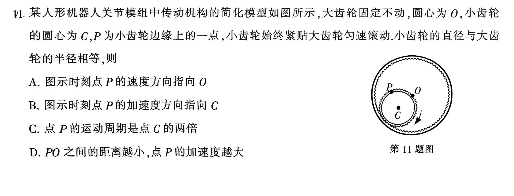

# ⚙️ 2026南通二模物理T11：卡尔丹圆运动学可视化与深度推导

🌟 **在线交互演示站点：** [https://five-plus-one.github.io/Cardan/](https://five-plus-one.github.io/Cardan/)

本项目针对“2026届南通二模物理第11题（人形机器人关节模组传动机构）”开发，旨在通过 HTML5 Canvas 动态可视化，直观剖析刚体平面运动中的经典模型——**卡尔丹圆（Cardan Circle）**。

---

## 📖 原题回顾

---

## 🧠 核心物理推导与解题思路

本题的核心破局点在于识别出**内摆线（Hypocycloid）**在 $R=2r$ 时的特例——点 $P$ 的轨迹并非曲线，而是一条**穿过大圆圆心的直线**，且点 $P$ 在该直线上做**简谐运动（SHM）**。

### 1. 轨迹方程推导 (数学证明)
设大齿轮半径为 $R$，小齿轮半径为 $r$，已知 $R=2r$。
设小齿轮圆心 $C$ 绕 $O$ 公转的角速度为 $\omega$。以 $O$ 为原点建立极坐标系，初始时刻 $P$ 点位于最右侧 $(R, 0)$。
* $C$ 点的坐标为：$(r\cos\omega t, r\sin\omega t)$
* 由于纯滚动无滑动，小齿轮滚过的弧长等于大齿轮走过的弧长。小齿轮相对自身圆心 $C$ 旋转的角度 $\phi = -\frac{R-r}{r}\omega t = -\omega t$。
* 点 $P$ 相对 $C$ 的坐标向量为：$(r\cos(-\omega t), r\sin(-\omega t))$

进行矢量合成，得到点 $P$ 的绝对坐标 $(x, y)$：
$$x = r\cos\omega t + r\cos(-\omega t) = 2r\cos\omega t = R\cos\omega t$$
$$y = r\sin\omega t + r\sin(-\omega t) = r\sin\omega t - r\sin\omega t = 0$$
**结论**：$y \equiv 0$，说明点 $P$ 的运动轨迹严格保持在 $x$ 轴上；且位移方程 $x = R\cos\omega t$ 证明了点 $P$ 做以 $O$ 为平衡位置的**简谐运动**。

### 2. 速度分析与瞬心法 (A 选项)
不使用微积分，纯用运动学几何也能秒杀 A 选项。
* **瞬心定位**：小齿轮与大齿轮的接触点 $K$ 处于无滑动纯滚动状态，故 $K$ 点速度为零，是小齿轮的**瞬时速度中心（瞬心）**。
* **几何关系**：线段 $KO$ 的长度恰好为 $R = 2r$，也就是小齿轮的直径。点 $P$ 位于小齿轮圆周上。
* **圆周角定理**：直径所对的圆周角为直角，因此必有 $\angle KPO = 90^\circ$。
* **速度方向**：由于小齿轮绕瞬心 $K$ 纯转动，点 $P$ 的速度方向 $\vec{v}_P$ 必定垂直于连线 $KP$。既然 $\vec{v}_P \perp KP$ 且 $PO \perp KP$，则 $\vec{v}_P$ 的方向**必然在直线 $PO$ 上**。
结合题图（小齿轮向左下角滚动，距离 $O$ 越来越近），可知速度方向指向 $O$。**故 A 选项正确**。

### 3. 加速度分析 (B、D 选项)
根据第一步得出的简谐运动位移方程 $x = R\cos\omega t$，对时间求二阶导数得到加速度：
$$a = \frac{d^2x}{dt^2} = -R\omega^2\cos\omega t = -\omega^2 x$$
* 加速度公式中的负号表明，加速度 $\vec{a}_P$ 始终指向位移的相反方向，即**始终指向平衡位置 $O$**，而不是指向小圆圆心 $C$。**故 B 选项错误**。
* 加速度大小 $a$ 与离开平衡位置的距离 $x$（即 $PO$ 距离）成正比。距离 $PO$ 越小，受到的等效“回复力”越小，加速度越小；当 $P$ 到达中心 $O$ 时，速度最大而加速度为零。**故 D 选项错误**。

### 4. 周期分析 (C 选项)
* 点 $C$ 绕 $O$ 公转的周期 $T_C = \frac{2\pi}{\omega}$。
* 从轨迹方程 $x = R\cos\omega t$ 可以看出，点 $P$ 简谐振动的圆频率同样是 $\omega$，其振动周期 $T_P = \frac{2\pi}{\omega}$。
两者周期完全相等。即：公转一圈的时间，点 $P$ 刚好在直线上完成一次从一端到另一端再返回的完整过程。**故 C 选项错误**。

---

## 💻 可视化系统特性

在[在线演示站点](https://five-plus-one.github.io/Cardan/)中，你可以亲手验证上述所有的推导：
1. **平行四边形矢量合成**：动态展示牵连速度 $\vec{v}_C$ 与相对速度 $\vec{v}_{P/C}$ 如何严丝合缝地合成为始终沿直线方向的绝对线速度 $\vec{v}_P$。
2. **题解**：点击右侧的原题选项卡（A/B/C/D），画布会自动高亮对应的矢量（如红色的加速度矢量 $\vec{a}_P$）并定格或播放动画，实现“所见即所得”的沉浸式解题体验。
3. **突破特例**：在自由探索模式中，你可以修改小齿轮的半径 $r$。当 $R \neq 2r$ 时，你将看到 P 点突破直线，画出华丽的“多瓣花”内摆线轨迹。

## 👨‍💻 关于作者

[@5plus1](https://five-plus-one.com)

[支持作者](https://r-l.ink/support)